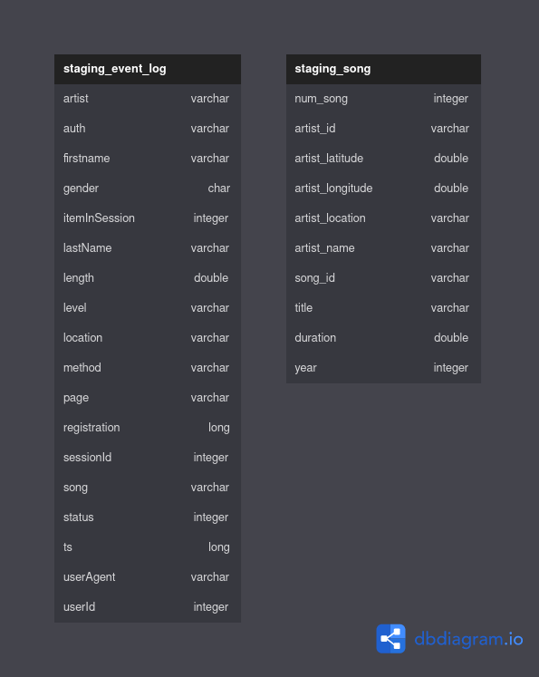

# Sparkify Data Pipeline

## Table of Contents

1. [Sparkify Data Lake](#sparkify-data-lake)
2. [Requirements](#requirements)
3. [Project Structure](#project-structure)
4. [Installation and Configuration](#installation-and-configuration)
5. [Execution](#execution)
6. [Results](#results)

In this project, we will implement a Data Lake for the fictional company Sparkify. The company is a music streaming platform and is interested in analyzing the data generated by its users to better understand their behavior and preferences.

The Data Lake implementation consists of processing and storing raw data in a centralized and easily accessible repository for future analysis and processing.

## Requirements

* Python 3.8+
* Apache Airflow 2.5.3 
* Docker
* Docker Compose
* AWS S3
* AWS Redshift

## Project Structure

* `dags/create_tables_dag.py`: This DAG script is responsible for creating the necessary tables in Redshift.
* `dags/etl_dag.py`: This DAG script handles the Extract, Transform, and Load (ETL) process for Sparkify's data.
* `plugins/operators/data_quality.py`: This custom Airflow operator checks the quality of the data loaded into Redshift.
* `plugins/operators/load_dimension.py`: This custom Airflow operator handles loading dimension tables in Redshift.
* `plugins/operators/load_fact.py`: This custom Airflow operator deals with loading fact tables in Redshift.
* `plugins/operators/stage_redshift.py`: This custom Airflow operator stages data from S3 to Redshift.
* `plugins/helpers/sql_queries.py`: Contains SQL queries for creating, inserting, and validating data in Redshift tables.
* `README.md`: Markdown file with information about the project.

## Installation and Configuration

1. Install Python 3.8 or higher.

2. Install Apache Airflow by following the [official installation guide](https://airflow.apache.org/docs/apache-airflow/stable/start/installation.html).

3. Install Docker and Docker Compose by following their respective installation guides:
   * [Docker](https://docs.docker.com/engine/install/)
   * [Docker Compose](https://docs.docker.com/compose/install/)

4. Set up your AWS S3 and Redshift instances, as well as the necessary security groups and IAM roles. For more information, refer to the [AWS documentation](https://docs.aws.amazon.com/index.html).

5. Configure the Airflow connections and variables for your AWS credentials and Redshift cluster information. You can do this by following the [official Airflow documentation](https://airflow.apache.org/docs/apache-airflow/stable/howto/connection/index.html).

## Execution

1. Start the Airflow webserver and scheduler by running the following command in your terminal:
   ```
   airflow webserver -D && airflow scheduler -D
   ```
2. Open the Airflow web interface in your browser at `http://localhost:8080`.

3. Enable the `create_tables_dag` and `etl_dag` by toggling the switch next to each DAG.

4. Manually trigger the `create_tables_dag` by clicking on the DAG and then clicking on the "Trigger DAG" button.

5. Once the `create_tables_dag` has completed successfully, manually trigger the `etl_dag`.



## Results

After the ETL process has completed, you will have a star schema in Redshift consisting of fact and dimension tables, allowing you to analyze and gain insights into user behavior and preferences on the Sparkify platform.


